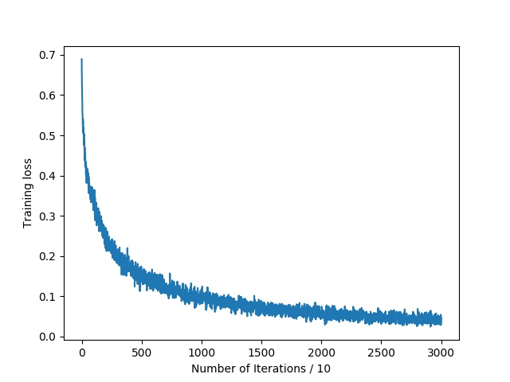
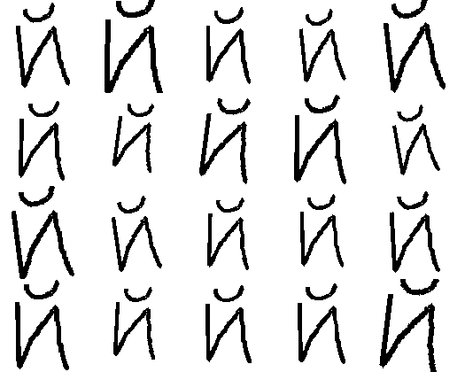

## Instructions to Run
```
# download the dataset
git clone https://github.com/brendenlake/omniglot.git
cd omniglot/python
unzip images_evaluation.zip
unzip images_background.zip
cd ../..


# Now create a directory to save models
mkdir models


# Train the model using
python3 train.py --train_path omniglot/python/images_background \
                 --test_path  omniglot/python/images_evaluation \
                 --gpu_ids 0 \
                 --model_path models


# Evaluate the model using
python3 evaluate.py

#Plot graph of loss using
python3 plot_loss.py

#Save examples of affine transformations using
python3 affine.py
```

## File Descriptions
- `train.py` - Consists of the main training code
- `mydataset.py` - Consists of custom datasets used for training and testing
- `plot_loss.py` - Code to plot and save the graph for training loss v/s iterations
- `affine.py` - Code to create and save affine transformations of custom images, with and without random sampling.
- `model.py` - Consists of the main model architecture of the convolutional siamese twins.
- `evaluate.py` - Code to evaluate the pre-trained model on 20-way one shot trials.

## Some Results

### Training loss


### Example of affine transformations

